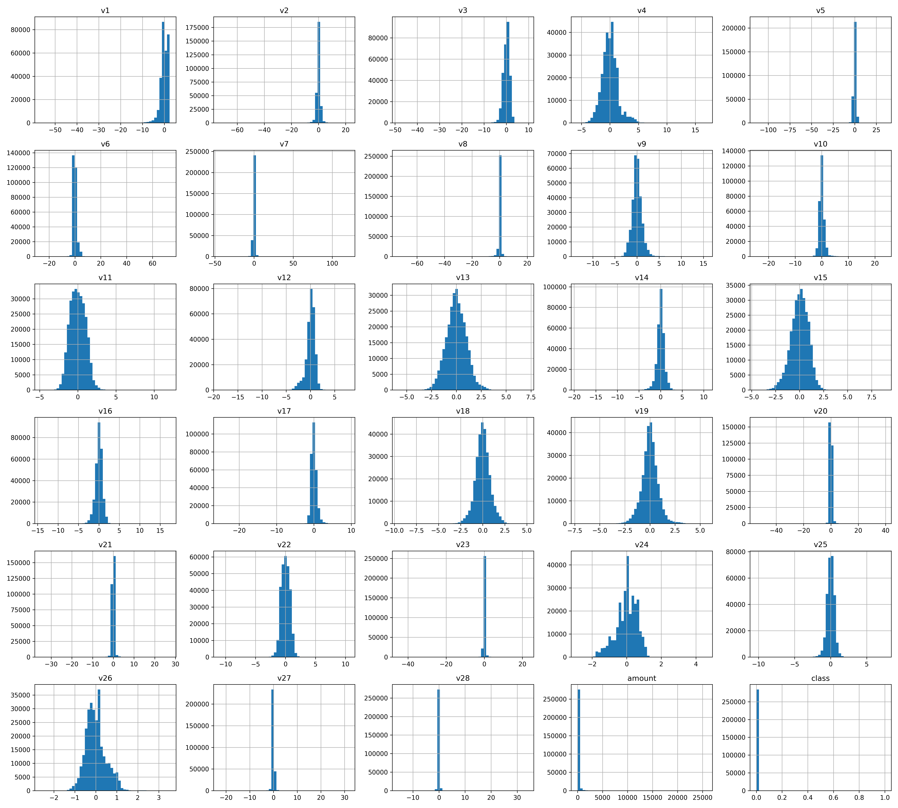
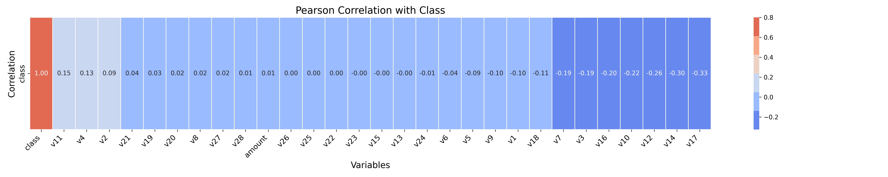
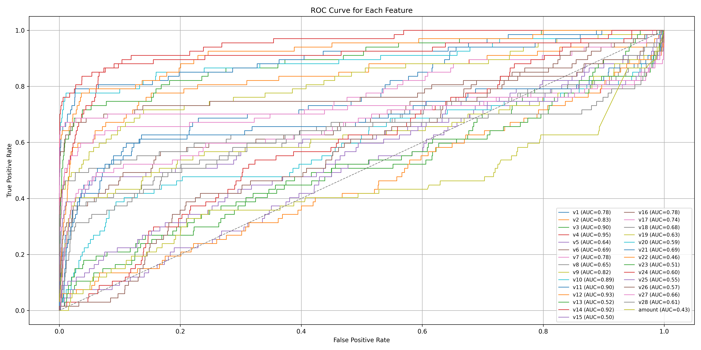

# Project overview

It is important that credit card companies are able to recognize fraudulent credit card transactions so that customers are not charged for items that they did not purchase.

**The aim of this project is to replicate a service utilized by one of these organizations to forecast if a transaction is fraudulent.** The service takes in all the details of a credit card purchase made by a client and provides as output the likelihood of the purchase being fraudulent, along with a suggestion on whether it should be marked as fraud. The feedback from this service can help avoid charging customers for items they did not buy. 

## Environment setup

To configure the virtual environment, follow the steps below:

1. Clone the repository
2. [Install UV](https://docs.astral.sh/uv/getting-started/installation/)
3. [Install dependencies using UV](https://docs.astral.sh/uv/concepts/projects/)

### **Requirements:**
- Python 3.12+
- UV

## Data

The dataset used in this project is based on the original csv was downloaded from: https://www.kaggle.com/datasets/mlg-ulb/creditcardfraud.
After the EDA stage of the data pipeline, it was noted that the training data is imbalanced when considered the target variable and some features. The target variable can only have two values, 1 or 0, to indicate the occurrence of fraud or not, respectively.

## Exploratory data analysis

Distribution per feature

    

Pearson correlation with class

    

ROC curve for each feature

    

## Materials

* [Credit Card Fraud Detection](https://www.kaggle.com/datasets/mlg-ulb/creditcardfraud)
* [credit_card_fraud_predictor](https://github.com/karinait/credit_card_fraud_predictor?tab=readme-ov-file)
* [PEEC2318 Machine Learning](https://github.com/ivanovitchm/PPGEEC2318)
* [mlops_nd_c3](https://github.com/ivanovitchm/mlops_nd_c3/tree/main)

___
**Feel free to contribute and explore the project!**
