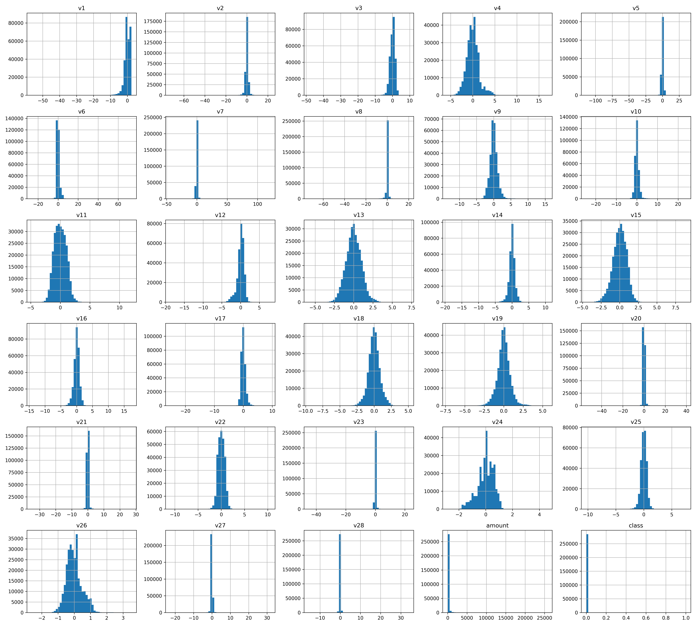
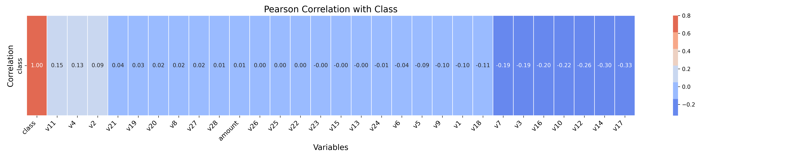
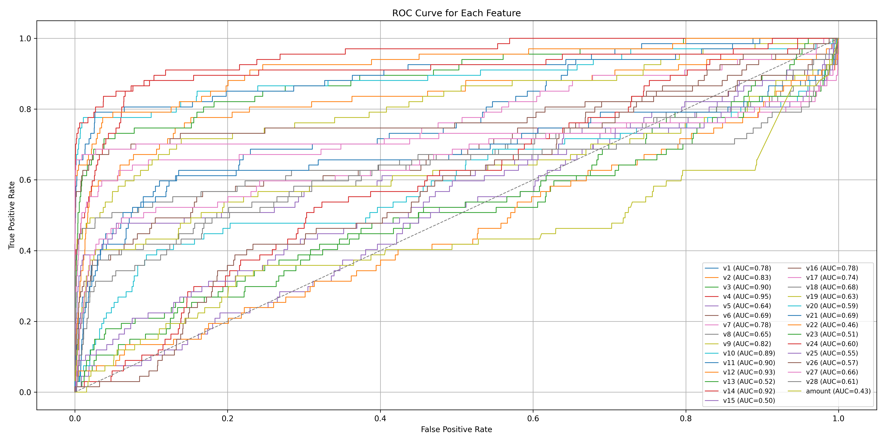
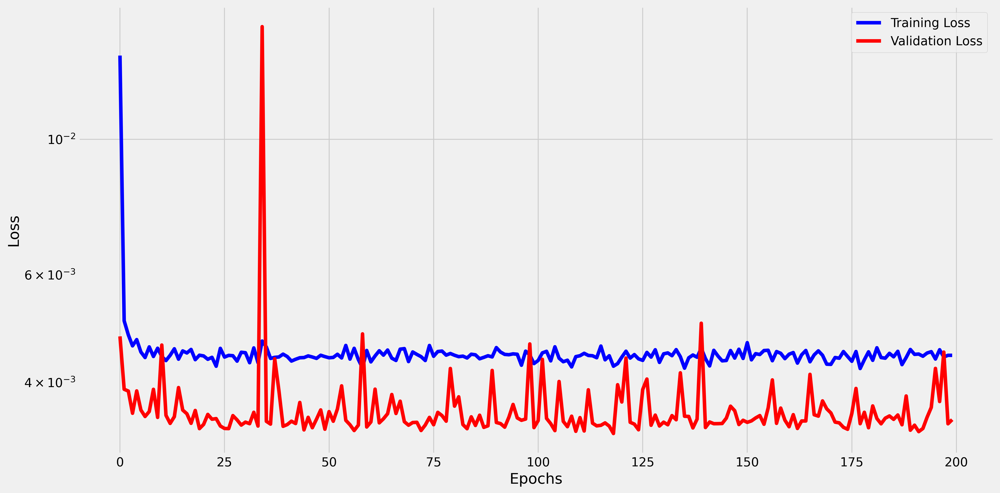
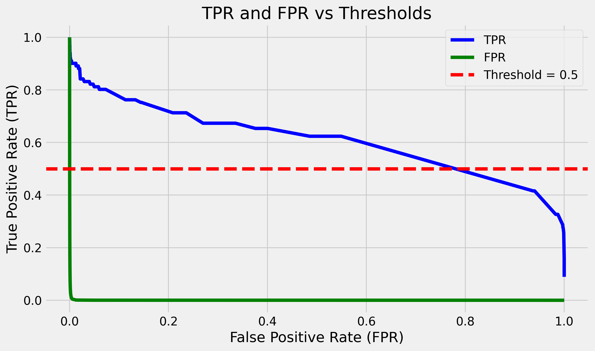

# Model Card

Credit card fraud happens when an individual takes or utilizes a credit card's details without the owner's consent. To fight and avert fraudulent transactions, credit card firms and financial organizations have established several measures. The majority of contemporary solutions utilize artificial intelligence (AI) and machine learning (ML). 

**The aim of this project is to replicate a service utilized by one of these organizations to forecast if a transaction is fraudulent.** The service takes in all the details of a credit card purchase made by a client and provides as output the likelihood of the purchase being fraudulent, along with a suggestion on whether it should be marked as fraud. The feedback from this service can help avoid charging customers for items they did not buy. 

Model card explanation

    Model cards are a succinct approach for documenting the creation, use, and shortcomings of a model. The idea is to write a documentation such that a non-expert can understand the model card's contents. For additional information see the Model Card paper: https://arxiv.org/pdf/1810.03993.pdf.

## Model Details

[@Miguel-mmf](https://github.com/Miguel-mmf) created the model using a defined architecture shared by [ivanowitchm]([https://](https://github.com/ivanovitchm/PPGEEC2318/blob/main/lessons/week05/week05c.ipynb)). I was able to use PyTorch, Scikit-Learn and Python programming language to set up and train a logistic regression model. So far, no simple tuning of the hyperparameters has been carried out.

## Intended Use

This model is being used as a proof of concept for the first project in the Machine Learning programme at the Federal University of Rio Grande do Norte's [PPGEEC](https://sigaa.ufrn.br/sigaa/public/programa/portal.jsf?id=103).

## Training Data

The dataset used in this project is based on the original csv was downloaded from: https://www.kaggle.com/datasets/mlg-ulb/creditcardfraud.
After the EDA stage of the data pipeline, it was noted that the training data is imbalanced when considered the target variable and some features. The target variable can only have two values, 1 or 0, to indicate the occurrence of fraud or not, respectively.

Distribution per feature

    

Pearson correlation with class

    

ROC curve for each feature

    

## Evaluating Data

The dataset under study is split into Train and Test during the [Exploratory Data Analysis](eda.ipynb) stage. 80% of the clean data is used to Train and the remaining 20% to Test.

Loss curves

    

Confusion matrix

    

ROC curve for validation data

    

TPR and FPR vc Tresholds

    

## Metrics

In order to follow the performance of machine learning experiments, the project marked certains stage outputs of the data pipeline as metrics. The metrics adopted are: 
* [**Accuracy**](https://scikit-learn.org/stable/modules/model_evaluation.html)

$\text{Accuracy} = \frac{TP + TN}{TP + TN + FP + FN}$

where TP = True Positives, TN = True Negatives, FP = False Positives, and FN = False Negatives.

* [**f1**](https://scikit-learn.org/stable/modules/model_evaluation.html)

$\text{F1} = 2 \cdot \frac{\text{Precision} \cdot \text{Recall}}{\text{Precision} + \text{Recall}}$

* [**Precision**](https://scikit-learn.org/stable/modules/model_evaluation.html)

$\text{Precision} = \frac{TP}{TP + FP}$

* [**Recall**](https://scikit-learn.org/stable/modules/model_evaluation.html)

$\text{Recall} = \frac{TP}{TP + FN}$

The follow results will be shown:

| Dataset | Threshold | Accuracy | F1 Score | Precision | Recall |
|-----------|-----------|----------|----------|-----------|--------|
| Train     |   0.05    |  0.9000  |  0.7757  |   0.7524  | 0.8005 |
| Test      |   0.05    |  0.9058  |  0.8241  |   0.8367  | 0.8119 |

**Threshold explanation:**  
The threshold value determines the cutoff for classifying predictions as positive or negative. Different thresholds can impact the balance between precision and recall. The chosen threshold (0.05) was selected based on the evaluation of metrics for each threshold value, aiming to achieve a good trade-off between accuracy, precision, recall, and F1 score.

## Ethical Considerations

We may be tempted to claim that this dataset contains the only attributes capable of predicting someone's income. However, we know that is not true, and we will need to deal with the class imbalances somehow.

## Caveats and Recommendations

It should be noted that the model trained in this project was used only for validation. It is notary that some important issues related to dataset imbalances exist, and adequate techniques need to be adopted in order to balance it.

**Miguel Marques**  
[GitHub](https://github.com/Miguel-mmf) • [LinkedIn](https://www.linkedin.com/in/miguelmf08) • [Gmail](miguel.ferreira@estudante.cear.ufpb.br) • [Gmail](miguel.ferreira.111@ufrn.edu.br)

